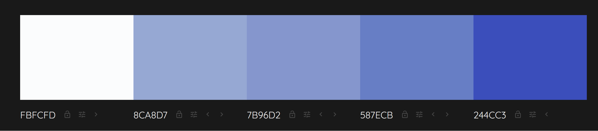

## Website Title (Homeland Living | real estate developer)

Is a website for people interested in real estate and newly build apartments/houses in particular

Goal is attraction of interest in product and to convey message of quality, reliability of project completion, and sustainability in construction work

placeholder for image/screenshot various devices

## Purpose

The project is a static website with 5 number of pages.

The website is built with HTML and CSS for Code Institute's Full Stack Developer course - Project 1

[FinalProject](https://werner-staeblein.github.io/Project-1/)

# User Experience

## First time users
**User Story 1: Potential homebuyer**

Wants to navigate website easily on all conceivable device. User is interested in newly built apartments or townhouses
Wants to see key characteristics of apartments for sale such as availability, size

**User Story 2: Potential homebuyer**

Explore information about neighborhood, amenities, assessment of location and overall offering

**User Story 3: Potential homebuyer**
Information thorugh images and floor plan structures available. Information on potential sustainability, reliability, quality

**User Story 4: Potential homebuyer**
Possibility to obtain further information with contact optionality, possible receive newsletter

## Returning users
        
**User Story 1: Returing visitor**

See if new property listings or projects have become available			
                
**User Story 2: Returing visitor**

Return to the website to support decision-making and information-gathering for potential purchase of real estate			
                
## All users
Users want to view and access the website from different devices with various screen-sizes			
Website shall be accessible with screenreaders			

# Structure

The website has 5 pages. From the homepage, all pages can be visited. Key of navigation centered around multiple options to view current projects/products on offer.

# Homepage

Message to user that user can find information about residential construction. Image of visioanry building to increase appeal and attractiveness/stickiness of user. Create curiositiy about "hello"-product (visionary building)

# Website goal

+ engage user to find more information
+ brand representation
+ route user to to products page and contact page to initate contact 

# Design

# Color Scheme

Color palette used with meaning and interpreation of blue color in mind. Blue conveys a sense of trust, stability and reliability. 

Color blue as core for the color scheme also conveys dependability, an important factor for the underlying product advertised ('dependable real estate developer')

# Typograhpy

Font type that conveys stability and credibility (Open Sans) used.
Google font-type hosted locally (without CDN) for reasons of European GDPR. Minimal loss on performance through local hosting of googlefonts but GDPR rules weigh more than performance benefit of CDN

# Images

Obtaining consistent AND FREE images usable for project on sites such as Pexels, Unsplash, Pixaby was difficult.

Images generated with image-generators.

Image Generator used:

[DeepAI](https://deepai.org/)

Selected images (unsplash, pexels) that are free of licenses in addition to images generated by image-generators.

# Accessibility

- use of aria labels with descriptive alt text for images and tags to procide information for screenreaders
- use of ARIA roles and aria-label to ensure smooth experience with screenreaders
- Website was checked with Google Lighthouse for color balance to be sufficient and to have best possible access for users with color blindness

# Visual effects

## Hover on buttons
Some subtle highlighting of background-color on hover/focus state for buttons

## Buttons
Uniform styling of all buttons across all the different pages sith subtle uniform hover/focus-state effect

# Features

### Logo (Home Page)

Logo created with LogoMaker of Experte.de [LogoCreatorExperte.de](https://www.experte.de/logo-maker#/creator)

The logo that serves as a link to the homepage is used in the navigation and footer. With click on logo, user can navigate back to homepage (index.html) all the time

### Buttons

Well-designed buttons to enhance website navigation. Guides users towrds important section of projects or contact page

### Hover Effects
Mild hover effects on buttons to add layer of responsiveness. Visual feedback, signaling to users that an element is interactive. This responsiveness contributes to a more engaging and dynamic user experience, making the website feel modern and user-focused.

### scroll to top button with arrow
For users with mobile devices, an easilty recognizable scroll-to-top button with arrow was included in footer

### submenu in footer
To ease navigation, a submenu with links to important pages was included in the footer

# Technologies used

- HTML, CSS

- [GitHub](https://www.github.com) - GitHub for storage of files

- [GitPod](https://www.gitpod.io/) - GitPod as IDE for development of this site

- [Git](https://git-scm.com) - Version control system Git

- [GoogleFonts](https://fonts.google.com/) - Google Fonts stored locally in project to company with European GDPR that does not allow for usage of CDN

- [FontAwesome](https://fontawesome.com/) - Fontawesome stored locally as CDN not allowed under European GDPR

- [HTMLValidator](https://validator.w3.org/) - W3C HTML markup validator for validation of HTML code

- [JigsawCSS](https://jigsaw.w3.org/css-validator/) - W3C Jigsaw CSS validator for validation of CSS code

- [DeepAI](https://deepai.org/) - to generate images

- [Visual Code Studios](https://code.visualstudio.com/) - IDE used to draft the webiste and make working progress remarks in the README.md including placehoders to check for final polishing

- [Google Chrome Dev Tools](https://developers.google.com/web/tools/chrome-devtools)- To check responsiveness of page, debug code, and important lighthouse checks for performance, accessibility, best practices, SEO

- A template provided by Code Institute for the workspace of the project

# Testing

Testing was ongoing with DevTools of Google. Testing done across other Browsers (Firefox, Edge)

The following issues were addressed while testing:

* remove redundant .css files in fontawesome folder so that only the fontawesome .css in the folder that are used in the project (reduces render-blocking files and increases site-load speed)

* ARIA warnings in lighthouse addressed with aria-labels and use of role. 

* ARIA warning on contrast. Occassionally, the lighthouse testing showed an insufficient contrast (scores reported yb lighthouse not always consistent with various test cycles). Change of colors and background colors to ensure sufficient contrast

* Performance and load of website was insufficient initally. Reduced image sizes to ensure that performance is improved

*  Lighthouse testing indicates minimal performance losses (values of 98-99) on mobile for use of fontawesome and google fonts locally (instaed of CDN). In order to be compliant 
with GDPR (a European law always matters more than a lighthouse performance score), I decided to maintain fontawesome and googlefonts locally without CDN as performance loss
is still acceptable. No performance losses on desktop

1. **[W3 Markup Validation](https://validator.w3.org/) - HTML Validation**

All sites of the website was tested with HTML validator while developing. No errors or warnings were found on any of the pages

2. **[W3 Jigsaw](https://jigsaw.w3.org/css-validator/) - CSS Validation**

The CSS stylesheet was tested with CSS validator (jigsaw) while developing. No errors were found.

3. **[Google Lighthouse](https://developers.google.com/web/tools/lighthouse)**

Lighthouse reported some minor performance losses for use of fontawesome and googlefonts locally. Both stored locally instead of CDN for reasons of GDPR. Minor losses on performance acceptable rather than using GDPR non-compliant CDN

**lighthouse test desktop (scores reported by lighthouse)**

| File                |  Perf.  | Access. | Best P. | SEO     |
|---------------------|---------|---------|---------|---------|
| index.html          |   100   |   100   |   100   |   100   |
| projects.html       |   100   |   100   |   100   |   100   |
| quality.html        |   94    |   98    |   100   |   100   |
| references.html     |   100   |   100   |   100   |   100   |
| contact.html        |   100   |   100   |   100   |   100   |

**lighthouse test mobile (scores reported by lighthouse)**

| File                |  Perf.  | Access. | Best P. | SEO     |
|---------------------|---------|---------|---------|---------|
| index.html          |   98    |   100   |   95    |   100   |
| projects.html       |   99    |   100   |   95    |   100   |
| quality.html        |   99    |   98    |   95    |   100   |
| references.html     |   99    |   100   |   95    |   100   |
| contact.html        |   100   |   100   |   95    |   100   |

# User Stories

| Expectations of user website             | Realisation in website              |
| --------------------- | ---------------------- |
| User wants to easily be informed about available projects       | Website provides information on properties in development, including location, surroundings, and available floorplan structures       |
| Local resident user wants information on construction progress, developments in the neighborhood       | Website showcases images and plans of planned projects, including information on potential amenities in the surroundings for local residents in the neighborhood       |
| User wants to be informed on key themes such as quality or sustainability       | Website allows users to obtain information about sustainability (green buildings) and quality control in the development process       |
| Returning user wants updates on potential new projects       | Website informs the returning user about the development progress and sales starting dates, including the number of units still available       |
| Mobile users want a responsive and mobile-friendly design       | Website is responsive for various devices, ensuring a user-friendly experience with different devices and screen sizes       |
| Potential property investor user wants to see key information on floor plans, development location, and short informative facts       | Website provides key parameters that investors watch out for in the projects section       |

# Credits

- The tutorial from Code Institute (Live Running Project) particularly helpful for the navigation.

- The video "Pure CSS Hamburger Menu & Overlay" on YouTube by author TraversyMedia was used to better understand workings of checkbox hack for hamburger menu

# Content

Text content of this website was written by the owner.
README.md file is based on structure of various README.md that students of Code Institute have used in their respective projects

# Acknowledgments

placeholder acknowledgements
