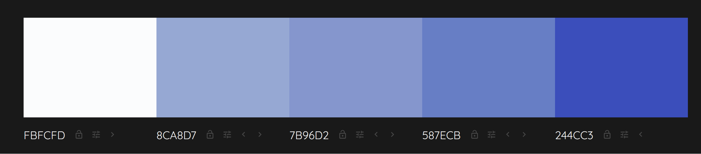

## Website Title (Homeland real estate)

Is a website for people interested in real estate and newly build apartments/houses in particular

Goal is attraction of interest in product and to convey message of quality, reliability of project completion, and sustainability in construction work

__placeholder for the screenshot of the final project__

## Purpose

The project is a static website with __X__ number of pages.

The website is built with HTML and CSS for Code Institute's Full Stack Developer course - Project 1

__placeholder for link of the final project__

## User Experience

# First time users

+ __placeholder for user stories of first time users__

# Returning users

+ __placeholder for user stories of returning users__

# All users

Users want to view and access the website from different devices with various screensizes (tablet, mobile, desktop, laptop)

## Structure

The website has __X__ pages. From the homepage, all pages can be visited. Key of navigation centered around multiple options to view current projects/products on offer.

# Homepage

Message to user that user can find information about residential construction. Image of visioanry building to increase appeal and attractiveness/stickiness of user. Create curiositiy about "hello"-product (visionary building)

# Website goal

+ engage user to find more information
+ brand representation
+ route user to to products page and contact page to initate contact 

# Design

# Color Scheme

Color palette used with meaning and interpreation of blue color in mind. Blue conveys a sense of trust, stability and reliability. Color blue as core for the color scheme also conveys dependability, an important factor for the underlying product advertised ('dependable real estate developer')

# Typograhpy

Font types that convey stability and credibility used.
Google Font-type hosted locally (without CDN) for reasons of European GDPR

# Images

Obtaining consistent AND FREE images usable for project on sites such as Pexels, Unsplash, Pixaby was difficult.

Images mostly generated with image-generators. Source of image-generators including image filenames. Selected images that are free of licenses in addition to images generated by image-generators.

# Accessibility

- use of aria labels with descriptive alt text for images and tags to procide information for screenreaders

Site was checked with __Toptotal Color filer (href needed)__ to verify tht color balance is sufficient to have best possible access for users with color blindness

## Visual effects

# Hover on buttons
Some subtle highlighting of background-color on hover/focus state for buttons

# Buttons
Uniform styling of all buttons across all the different pages sith subtle uniform hover/focus-state effect

## Features

# Logo (Home Page)

Logo created with LogoMaker of Experte.de [LogoCreatorExperte.de](https://www.experte.de/logo-maker#/creator)

The logo that serves as a link to the homepage is used in the navigation and footer. With click on logo, user can navigate back to homepage (index.html) all the time

## Technologies used

- HTML, CSS
- __placeholder for image-generators__
- GitHub for storage of files
- GitPod as IDE for development of this site
- Git as version control system
- Google Fonts (stored locally in the project to comply with European GDPR that does not allow usage of CDN)
- Fontaweseom (stored locally as CDN not allowed under European GDPR)
- W3C HTML markup validator for validation of HTML code
- W3C Jigsaw CSS validator for validation of CSS code

## Testing

Testing was ongoing with DevTools of FireFox. Testing done across other Browsers (Google Chrome, Edge)

## User Stories

| Expectations of user                              | Realisation in website   |
| -----------------------                           | ----------------------   |
| __placeholder for user expectation__              | __placeholder for realisation__             |
| __placeholder for user expectation__              | __placeholder for realisation__             |
|| __placeholder for user expectation__             | | __placeholder for realisation__             |

## Credits

- The tutorial from Code Institute (Live Running Project) particularly helpful for the navigation.

- The video "Pure CSS Hamburger Menu & Overlay" on YouTube by author TraversyMedia was used to better understand workings of checkbox hack for hamburger menu

## Content

Text content of this website was written by the owner.
README.md file is based on structure of various README.md that students of Code Institute have used in their respective projects

## Acknowledgments

__placeholder acknowledgements__